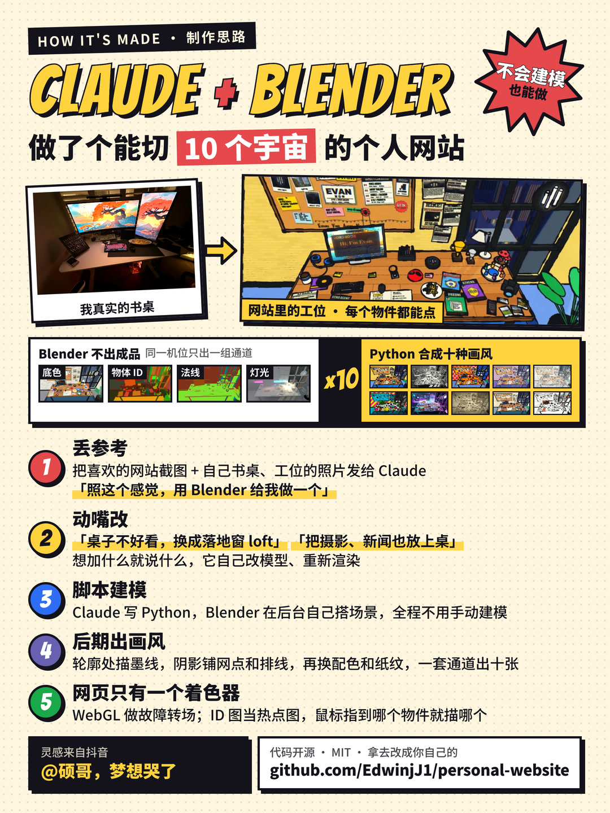

# Evan 的个人网站：一张桌子，十个宇宙

Blender 建模的工位场景，同一个机位渲染后合成 10 种印刷 / 漫画风格，网页里用 WebGL 切换。
点桌上的蜘蛛面具或按空格换宇宙；点物件看对应的项目和经历，相机和拍立得是摄影集，报纸是新闻，笔记本是博客，手柄是全部项目，显示器是 AI 对话，唱片是能放歌的黑胶唱片机，杯子是友链蛛网。

整体创意（Blender 渲染一张工位，再切换多种画风）来自抖音 @硕哥，梦想哭了 的个人网站，感谢。这个仓库是照着那个思路，用 Claude + Blender 从头做的一版。



## 怎么跑

```sh
npm run dev      # http://localhost:4173
npm test         # 坐标换算 + 内容完整性（node --test，带覆盖率）
```

`site/` 是纯静态站，没有构建步骤，任何静态托管都能直接放。

## 目录

| 路径 | 内容 |
|---|---|
| `site/` | 网页：`js/app.js`（交互）、`js/stage.js`（WebGL）、`js/geometry.js`（坐标换算）、`js/content.js`（中英文案）、`js/music.js`（播放器）、`js/web.js`（友链蛛网布局） |
| `site/assets/` | 渲染产物：`styles/<宇宙>.webp`（全尺寸 + `@1x`）、`hot.png`（热点图）、`scene.json`；`data/*.json` 和 `photos/` 是从上一代网站导入的内容 |
| `blender/` | `kit.py` 建模工具，`layout.py` 场景内容，`scene.py` 分通道渲染入口，`tex/` 贴图 |
| `pipeline/` | `textures.py` 画场景里的印刷品，`stylize.py` 把通道合成十种风格 |
| `workers/api/` | 对话后端（Cloudflare Worker，`/chat` 转发到模型），部署方式见下 |
| `tests/` | 单元测试 |

## 重新出图

需要 Blender（5.x）、uv 和 Node 23.6+。几步可以单独跑：

```sh
npm run import     # 从 ../001 导入项目、博客、新闻、友链，并把全部摄影作品缩成网页尺寸
npm run photos     # 只更新摄影：重写清单，缩新增的照片（已有的不重新缩）
npm run textures   # 软木板、剪报、刊物封面、屏幕等贴图 → blender/tex
npm run render     # Blender 渲染底色 / 发光 / ID / 法线 / 深度 / 5 组灯光 → build/passes
npm run stylize    # 合成 10 种风格 + 热点图 → site/assets
```

- 改桌上有什么、摆在哪：`blender/layout.py`。物件的 `hot="名字"` 就是网页里的热点名。
- 改墙上、封面上的字：`pipeline/textures.py`。
- 改某个宇宙的画风：`pipeline/stylize.py` 里同名的函数。
- 改面板文案：`site/js/content.js`。加了新热点要在 `HOTS` 和 `LABELS` 里登记，测试会检查。

调画风时先用小图：把 `render` 里的 `--width 3840` 换成 `1600`，再 `uv run pipeline/stylize.py build/passes build/test --only=comic,noir`。

## 拿去做你自己的

代码是 MIT，可以直接 fork。要换成你自己的站，改这几处：

| 想换的东西 | 改哪里 | 要不要重新渲染 |
|---|---|---|
| 名字、自我介绍、每个面板的文案 | `site/js/content.js` | 不用 |
| 项目、博客、友链、摄影清单 | `site/assets/data/*.json`，照片放 `site/assets/photos/` | 不用 |
| 墙上、封面、屏幕里的字 | `pipeline/textures.py` | 要 |
| 桌上有什么、摆在哪 | `blender/layout.py` | 要 |
| 某个宇宙的画风 | `pipeline/stylize.py` 里同名的函数 | 只跑 `npm run stylize` |
| 对话里的 AI | 自己部署 `workers/api`，把地址填进 `content.js` 的 `CHAT.api` | 不用 |
| 唱片机的歌单 | `pipeline/sync_music.py` 的 `PLAYLIST_ID` | 不用 |

- `npm run import` 和 `npm run photos` 读的是作者上一代网站（`../001`），你用不上：直接改 `site/assets/data/` 里的 JSON 就行。
- 重新渲染是 `npm run textures && npm run render && npm run stylize`，4K 一套在 M1 Max 上十分钟左右。
- 部署：`site/` 是纯静态目录，放到任何静态托管都行。仓库里的 `.github/workflows/deploy.yml` 是发到 GitHub Pages 的写法，可以照抄。
- 仓库里的摄影作品、文字和个人形象不在 MIT 范围内，换成你自己的。

不想手改的话，把仓库交给 Claude Code，用大白话说就行。做这个站时说过的几句（原话，略有删减）：

- 「你看这个人的，用 Blender 做了 10 种风格的个人网站，很酷炫。忘掉我现在的网站，重新制作」（附上参考截图和自己书桌的照片）
- 「制作的高级一点，落地窗高楼都行，或者外面是 loft 那种，总之要高级」
- 「房间的布置没必要完全按照我自己的房间去搞，主要还是参考他这个，做一点点改变」
- 「现在个人网站里有的东西也要放在这里边，包括我那些摄影的照片，除了照片以外还有 news」
- 「把场景里的占位小字都换成真实内容」
- 「友链这里能不能用一种可视化、连在一起的方案，我们这个也是宇宙风格的」

## 画面是怎么来的

1. Blender 不直接出成品，而是出一组通道：纯底色、发光、每个物体一个颜色的 ID 图、法线、深度，以及白模下每组灯光单独的光照。
2. `stylize.py` 用这些通道合成：ID / 法线 / 深度的突变处是墨线，光照量化成明暗后在暗部铺网点和排线，再套各宇宙的配色和纸张。
3. ID 图同时导出成热点图，网页用它做像素级的悬停判断和描边。

## 说明

- 蜘蛛面具、蛛网、EARTH 编号是对《蜘蛛侠：平行宇宙》的致敬，图形都是自己画的，没有使用官方素材。
- 显示器里的对话接的是 `workers/api` 这个 Cloudflare Worker。主通道是 Workers AI 的原生绑定（`@cf/meta/llama-3.3-70b-instruct-fp8-fast`，不需要任何密钥）；配了 `AI_API_KEY` 时还有一个 OpenAI 兼容的备用通道。两条都不通时，网页退回预设回答并注明。改了人设提示词（`workers/api/src/index.js`）要在那个目录下 `npx wrangler deploy` 才生效。
- 唱片机放的是网易云歌单「-EdwinJ-喜欢的音乐」。`pipeline/sync_music.py` 读公开歌单（不带登录信息），只留不用会员就能听的歌，写进 `music.json`；声音走网易云官方外链，放不了的（会员曲目、地区限制）自动跳过。换歌单改脚本里的 `PLAYLIST_ID`，本地更新用 `npm run music`；部署时也会同步一次，抓不到就用仓库里的快照。
- 摄影是旧站 `../001/src/data/photography.ts` 里的全部作品，网页上按分类归成合集（封面是每个分类的第一张，点开才是整组）。合集的先后和名字在 `content.js` 的 `ALBUMS`；加照片就是把原图放进 `../001/public/images/photography/`、在 `photography.ts` 里登记一条，再跑 `npm run photos`。`Her` 是单独的一个分类，不并进人像。
- 友链在 `site/assets/data/friends.json`（来源是 `../001/src/data/friends.ts`），加一条就多一根蛛丝。
- 新闻每 6 小时由 `.github/workflows/deploy.yml` 抓一次并重新部署，结果只进当次部署，不往仓库里提交；仓库里的 `news.json` 是兜底快照。本地更新用 `npm run news`。
- 部署：推到 `main`（改动涉及 `002/site/`）就会发布到 GitHub Pages（evanlin.site）。
- 简历不放在这个站里，也不进这个仓库。
- 代码以 MIT 协议开源（见仓库根目录的 `LICENSE`）。摄影作品、文字和个人形象不在此列，版权归作者所有。
